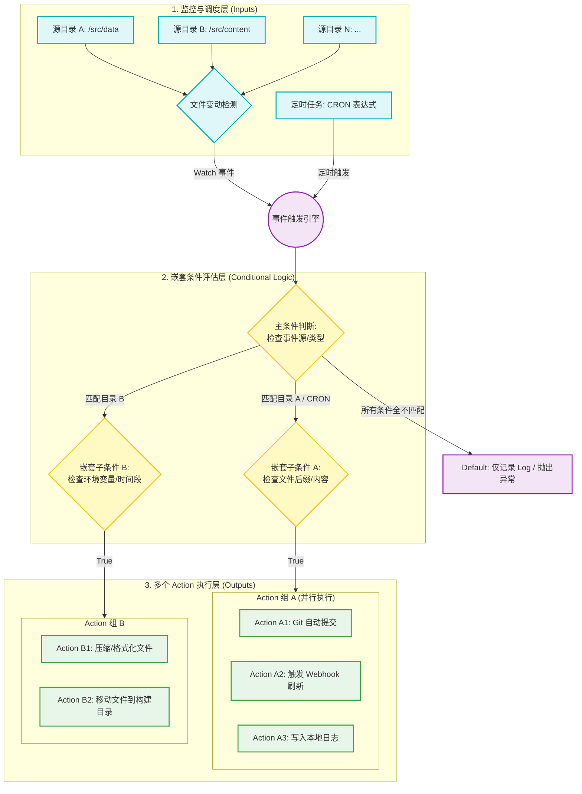

EasyTidy Pro 是一个专为 Windows 用户打造的现代化、全离线文件自动分类整理工具。
 - **🚀自动化归档：** 基于灵活的规则引擎，实现文件的一键或全自动分类。
 - **🎨现代化体验：** 深度融入 Fluent UI 设计语言，带来精致、流畅的视觉与交互。
 - **🔒纯离线运行：** 无需网络连接，在保障极致处理性能的同时，绝对守护您的数据隐私。

## 准备工作

开始之前，请确认你的设备满足以下要求：

### 1. 下载 EasyTidy Pro

从以下任一渠道下载最新版本：

* [官网（推荐）](https://download.easytidy.net/stable/EasyTidyPro_win-x64_Setup.exe)
* [GitHub Releases](https://github.com/EasyTidy/EasyTidy-Releases/releases)

### 2. 系统要求

* Windows 10（版本 1809 或更高）
* Windows 11
* 64 位（x64）系统

### 3. 安装依赖

EasyTidy Pro 依赖 Microsoft .NET 运行时。

安装程序会自动检测系统环境，并在缺少依赖时引导你完成安装，无需手动下载或配置。

## 安装 EasyTidy Pro

1. 双击下载的安装程序。
2. 按照安装向导完成安装。
3. 如果系统缺少必要的运行时依赖，安装程序会自动检测并引导完成安装。
4. 安装完成后，启动 EasyTidy Pro。

:::tip
建议保持默认安装路径。如需安装到其他位置，可在安装过程中自行修改。
:::

## 软件界面
安装完成后，启动 EasyTidy Pro，即可看到主界面。


主界面左侧为导航菜单，分为**主导航**和**底部导航**两部分：

#### 主导航

- **首页**：查看软件概览、最近活动以及标签中心等信息。
- **整理任务**：自动归类、批量重命名、设置标签 —— 一条规则搞定文件整理。
- **多步流程**：把分类、重命名、移动串成一条流程，像搭积木一样按顺序或并行运行。
- **自动运行**：定时自动运行，或者文件一有变动就立刻触发。设好就不用管了。
- **运行日志**：每次任务处理了哪些文件、有无出错、发生了什么变化，一目了然。

#### 底部导航

- **待确认**：AI增强自动整理时拿不准的文件。
- **设置**：管理软件配置、主题、快捷键、更新、可选组件、关于等选项。
- **集成设置**：配置 S3、WebDAV、网盘、文件传输等扩展集成功能。

:::note[Windows 默认会隐藏新安装应用的托盘图标]
建议将 **EasyTidy Pro** 的托盘图标拖动到可见区域，方便随时查看软件运行状态和快速打开主界面。

:::


## 核心概念

在开始创建第一个整理任务之前，建议先了解 EasyTidy Pro 的几个核心概念。

### 整理任务

整理任务用于定义整理哪些文件以及如何整理这些文件，是 EasyTidy Pro 中最常用、也是最核心的功能。

每个整理任务可以指定一个源目录作为整理对象；如果未指定源目录，也可以通过整理浮窗临时整理拖放的文件。

例如，你可以创建多个整理任务，分别用于：

* 整理下载目录
* 整理桌面文件
* 整理图片资源
* 整理工作文档

每个整理任务相互独立，可根据不同的使用场景灵活创建和管理。

### 多步流程

多步流程用于将多个处理步骤组合成一个完整的自动化流程，适用于需要按顺序执行多个操作的场景。

例如：

```text
扫描文件
    ↓
筛选符合条件的文件
    ↓
移动到指定目录
    ↓
重命名文件
    ↓
压缩归档
```



## 创建第一个任务

1. **定义文件或者文件夹规则**
   - 点击任务编排界面的`添加任务`按钮
   - 填写任务名称跟任务组名称，尽量保证任务名称不重复，用于在[自动化](/zh-cn/guide/automation)界面对任务进行关联
   - 点击处理规则旁边的紫色按钮，选择系统预设的处理规则或者自己直接输入文件规则，多个规则用`|`或`;`分割。例如处理压缩文件的规则`*.7z;*.zip;*.rar`

2. **关联高级规则(可选)**
   - 点击处理规则旁边的`漏斗`按钮可以选择在过滤器页面定义的规则，选择之后将进行关联。
3. **选择文件处理方式**
   - `移动`：文件从源文件夹移动到目标文件夹，文件结构跟名称不变。
   - `复制`：文件从源文件夹复制到目标文件夹，文件结构跟名称不变。
   - `重命名`：文件从源文件夹复制到目标文件夹，但文件名会根据规则进行重命名。
   - `回收站`：将文件进行删除，可在系统回收站中找回，前提条件是没有在文件删除之后清理过系统回收站。
   - `删除`：直接将相关文件进行删除，并且不可恢复。（请谨慎选择此操作）
   - `解压`：自动将压缩文件进行解压。
   - `压缩`：自动将文件进行压缩，压缩包类型为 zip。
   - `上传至WebDAV`：将符合规则的文件自动上传到 WebDAV 服务器。
   - `硬连接`：在同一文件系统内创建指向原始文件的新链接。
   - `软连接（符号链接）`：创建指向原始文件或目录的符号链接。
   - `文件快照`：将硬盘驱动器的完整文件夹层次结构捕获并导出为 HTML 格式的快照文档。
   - `文件加密`：提供 7z 压缩包加密或 AES-256 结合 PBKDF2 派生密钥加密。
   - `运行外部程序`：执行外部程序或者是脚本。
   - `AI总结`：使用 AI 总结文件内容，并且输出为 PDF 文件。
   - `AI分类`：使用自然语言指定分类方式，并对文件进行分类整理。

4. **快捷方式与启用**
   - `是否启用`：是否启用此任务。
   - `快捷方式`：是否在桌面创建快捷方式。

## 设置自动运行方式

用于配置自动处理的任务，以及自动处理的触发方式。

1. **触发方式**
   - `文件变更`：当文件变动时，自动运行关联任务。
   - `启动时`：在 EasyTidy 启动时，自动运行关联任务。
   - `定期执行`：根据设定的时间间隔自动执行关联任务。
   - `按照计划`：根据设定的时间表或者 CRON 表达式进行执行。

2. **关联任务**
   - `任务组`：同一个分组名称下的所有任务都会被关联，并且使用相同的触发方式。
   - `是否单独配置`：勾选之后，可以对单个任务进行单独配置。
